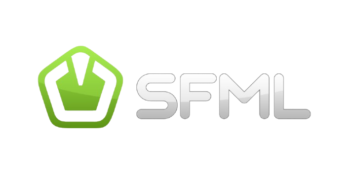

<div align="center"></div>
<h1 align="center">SFML + OpenGL + Dear ImGUI</h1>

<div align="center">


<br>


</div>

## Table of Contents
- [Table of Contents](#table-of-contents)
- [📖 About](#-about)
- [✨ Features](#-features)
- [📦 Structure](#-structure)
- [📚 Libraries](#-libraries)
- [🔧 Build](#-build)
  - [Nix (recommended for MacOS and Linux)](#nix-recommended-for-macos-and-linux)
  - [Windows (WSL)](#windows-wsl)
- [🚀 Releases](#-releases)
- [📜 License](#-license)


## 📖 About

This is a simple template for C / C++ projects using SFML, OpenGL and Dear ImGUI under to hood to do
3D and build GUI.

## ✨ Features

- 🔄 **Reproducible**: Built with Nix, this configuration can be effortlessly reproduced on other
  machines, ensuring a consistent setup.

- 📖 **Documented**: Most of the parts of my configuration files are commented and documented with
  links and explanations if necessary

## 📦 Structure

- **Directories**

  - [**`includes`**](./includes/) - Headers (`.hpp/.h`)
  - [**`src`**](./src/) - Source files (`.cpp`)
  - [**`libs`**](./libs/) - External libraries
  - [**`assets`**](./assets/) - Images, Shaders and other Resources.
  - [**`docs`**](./docs/) - Documentation
  - [**`tests`**](./tests/) - Test files
  - [**`build`**](./docs/) - CMake build files
  - [**`bin`**](./docs/) - Shared libraries (if needed)

- **Files**

  - `flake.nix` - Environment configuration (based on [**dev-templates**](https://github.com/the-nix-way/dev-templates))
  - `.envrc` - Used by **direnv** to load **Flakes**
  - `flake.lock` - Used by **Flakes** to version packages
  - `CMakeLists.txt` -  CMake configuration to build the project

## 📚 Libraries

- [**Dear ImGui**](https://github.com/ocornut/imgui) ~ Bloat-free Graphical User interface for C++
  with minimal dependencies
- [**SFML**](https://github.com/SFML/sfml) ~ Simple and Fast Multimedia Library
- [**GLAD**](https://glad.dav1d.de/) ~ OpenGl loader
- [**stb**](https://github.com/nothings/stb) ~ Stb single-file public domain libraries for C/C++
- [**glm**](https://github.com/g-truc/glm) ~ OpenGL Mathematics

> [!NOTE]
>
> Looking at the source code of [SFML](https://github.com/SFML/SFML), it appears that **stb** and
> **GLAD** are already included (but I keep them here anyway).

## 🔧 Build

### Nix (recommended for MacOS and Linux)

> [!NOTE]
>
> I'm using NixOS as my day-to-day OS, and I have found that **Nix** with **Flakes** was the
> simplest and fastest way for me to setup C/C++ project with external libraries.

To build this project, first make sure you have [Nix](https://nixos.org/download/) installed as a
package manager and [direnv](https://direnv.net/) as a shell extension.

Then, configure it to enable [Flakes](https://nixos.wiki/wiki/flakes) according to your setup.

Once you're ready, you can start by cloning this repo

```bash
git clone https://github.com/leoraclet/sfml-imgui-template
cd sfml-imgui-template
```

> [!TIP]
>
> Now, **direnv** should load the environment when inside the project directory, if not, try
> ```bash
> direnv allow
> ```

The `flake.nix` file is where the project's environment is defined, and you can see in it that
[CMake](https://cmake.org/) is part of the packages. So, if everything went well, you should be able to
build the project like so

```bash
cmake -B build -S .
cd build
cmake --build .
```

Then, you can run the produced executable in `build` with

```basb
./example
```

### Windows (WSL)

> [!WARNING]
>
> I have **NOT** tested the building process on Windows, so you're basically on your own for this.

The best solution to build this project on Windows is to use
[WSL](https://learn.microsoft.com/en-us/windows/wsl/install) and follow the
[Nix](#nix-recommended-for-macos-and-linux) way in it.

You can start by installing nix [here](https://nixos.org/download/#nix-install-windows).

## 🚀 Releases

~~To run the program without editing the source code or building it yourself, go see the
[**Releases**](https://github.com/leoraclet/sfml-imgui-template/releases).~~

> [!WARNING]
>
> This is template repo, so threre isn't releases for this one.

## 📜 License

This project is licensed under the MIT License - see the [LICENSE](LICENSE) file for details.